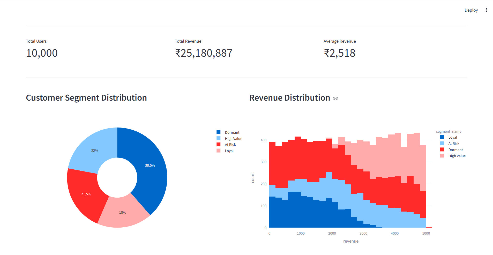
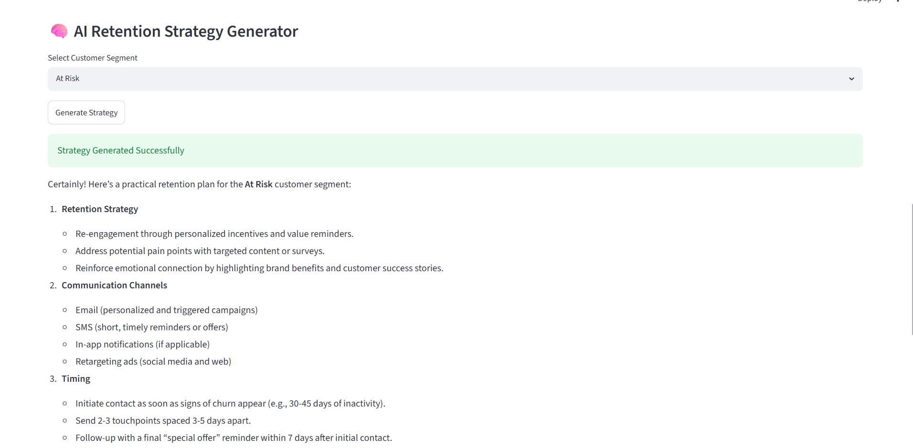
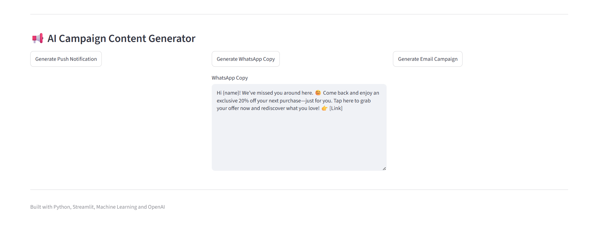

# 🤖 AI Retention Copilot

An AI-powered CRM intelligence platform that combines Machine Learning and Generative AI to help identify churn risks, segment customers, generate retention strategies, and create marketing campaigns automatically.

---

## 🚀 Features

### Machine Learning

* Customer Churn Prediction using Random Forest
* Customer Segmentation using K-Means
* Customer Risk Identification

### AI Capabilities

* AI-Powered Retention Strategy Generation
* Communication Channel Recommendations
* Campaign Timing Suggestions

### Campaign Generation

* Push Notification Generation
* WhatsApp Campaign Generation
* Email Campaign Generation

### Dashboard

* Customer Segment Distribution
* Revenue Analysis
* Segment Overview
* Interactive Streamlit Dashboard

---

## 🏗️ Architecture

```text
Customer Data
      ↓
Churn Prediction
      ↓
Customer Segmentation
      ↓
AI Retention Strategy
      ↓
Campaign Generation
      ↓
Dashboard
```

---

## 📸 Screenshots

<h3>Dashboard</h3>


<h3>AI Retention Strategy Generator</h3>


<h3>AI Campaign Generator</h3>


---

## ⚙️ Tech Stack

* Python
* Pandas
* Scikit-Learn
* OpenAI API
* Streamlit
* Plotly
* Joblib

---

## ▶️ Run Locally

Install dependencies:

```bash
pip install -r requirements.txt
```

Generate sample customer data:

```bash
python src/data_generator.py
```

Train churn prediction model:

```bash
python src/churn_model.py
```

Generate customer segments:

```bash
python src/segmentation.py
```

Launch dashboard:

```bash
streamlit run app.py
```

---

## 🎯 Business Use Case

This project simulates how CRM and Lifecycle Marketing teams can leverage Machine Learning and AI to:

* Identify churn-prone customers
* Understand customer segments
* Generate retention strategies
* Create campaign content automatically
* Reduce manual effort in campaign planning

---

## 👨‍💻 Author

Nikunj Keswani

Growth & Retention Marketing | CRM | AI
